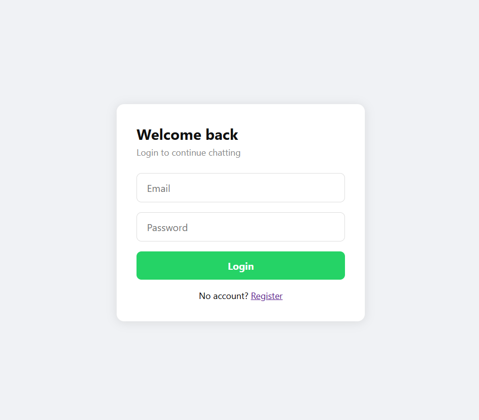
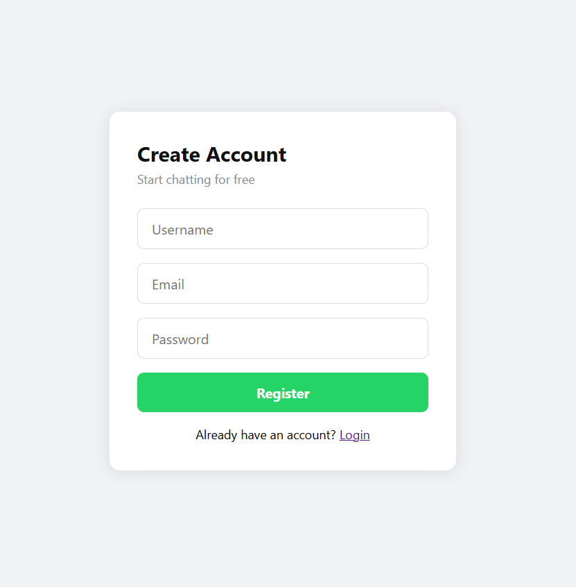
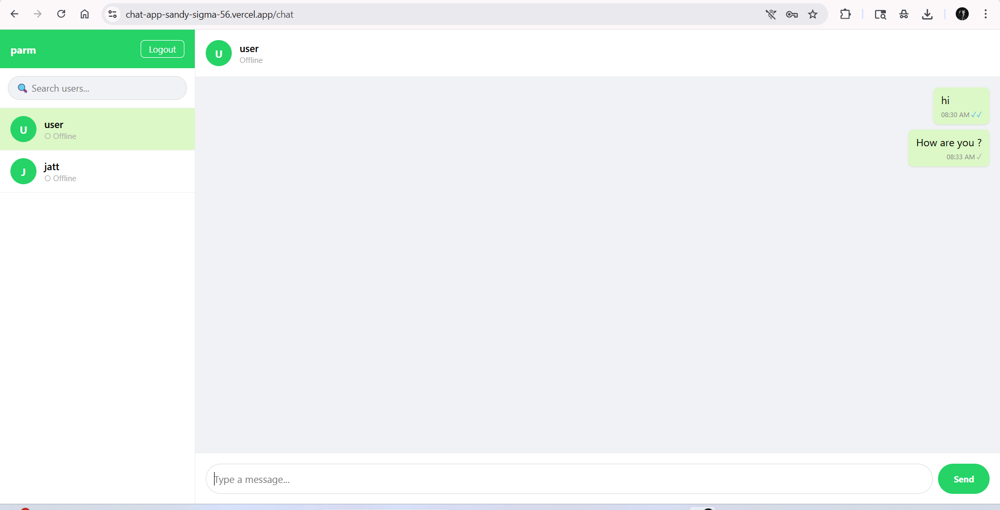
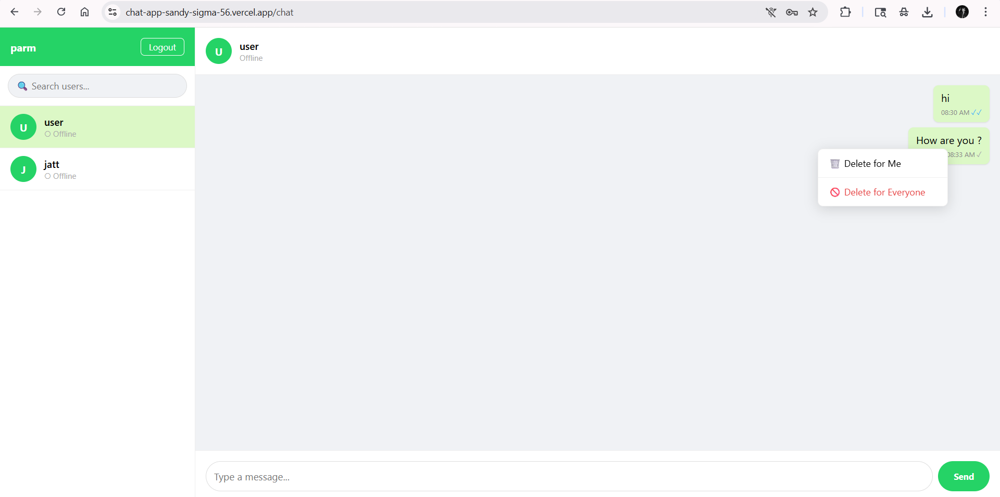

# 💬 ChatApp — Real-Time Chat Application

<div align="center">


[](https://nodejs.org/)
[](https://reactjs.org/)
[](https://socket.io/)
[](https://www.postgresql.org/)
[](https://redis.io/)

**A production-grade, real-time chat application built from scratch — inspired by WhatsApp.**

[Live Demo](https://chat-app-sandy-sigma-56.vercel.app) · [Report Bug](https://github.com/in-punjab/Chat-App/issues) · [Request Feature](https://github.com/in-punjab/Chat-App/issues)

</div>

---

## ✨ Features

| Feature | Description |
|--------|-------------|
| 🔐 **JWT Authentication** | Secure register/login with hashed passwords |
| ⚡ **Real-Time Messaging** | Instant message delivery via WebSockets |
| 🟢 **Online/Offline Status** | See who's available in real time |
| ✓✓ **Read Receipts** | Grey tick = sent, Blue tick = read |
| ✍️ **Typing Indicator** | Animated dots when someone is typing |
| 🔴 **Unread Badge** | Message count badge on sidebar |
| 🔍 **User Search** | Search and filter users by username |
| 🗑️ **Delete Messages** | Delete for yourself or for everyone |
| 📱 **Responsive UI** | Clean WhatsApp-inspired interface |
| 🔒 **Private & Secure** | Users can only access their own chats |

---
## 📸 Screenshots

### Login & Register
<div align="center">
  
  &nbsp;&nbsp;
  
</div>

---

### Real-Time Chat
<div align="center">
  
  
</div>

## 🛠️ Tech Stack

### Frontend
- **React** (Vite) — UI framework
- **React Router** — Client-side routing
- **Socket.IO Client** — Real-time communication
- **Axios** — HTTP requests

### Backend
- **Node.js + Express** — REST API server
- **Socket.IO** — WebSocket server
- **JWT** — Authentication tokens
- **bcryptjs** — Password hashing

### Database & Infrastructure
- **Supabase (PostgreSQL)** — Primary database
- **Vercel** — Frontend hosting
- **Render** — Backend hosting

---

## 🏗️ System Design

```
┌─────────────────────────────────────────────────────────┐
│                     CLIENT (React)                       │
│          Vercel — https://chatapp.vercel.app            │
└──────────────────────┬──────────────────────────────────┘
                       │ HTTP (REST) + WebSocket
                       ▼
┌─────────────────────────────────────────────────────────┐
│                  SERVER (Node.js)                        │
│         Render — https://chatapp.onrender.com           │
│                                                         │
│   ┌─────────────┐         ┌──────────────────┐         │
│   │  REST API   │         │   Socket.IO      │         │
│   │  /api/auth  │         │  Real-time layer │         │
│   │  /api/users │         │  Online tracking │         │
│   │  /api/msgs  │         │  Message relay   │         │
│   └──────┬──────┘         └────────┬─────────┘         │
└──────────┼──────────────────────────┼───────────────────┘
           │                          │
           ▼                          ▼
┌──────────────────────┐   ┌─────────────────────────────┐
│  Supabase PostgreSQL │   │     In-Memory Store         │
│  - users             │   │  { userId → socketId }      │
│  - messages          │   │    Online user tracking     │
└──────────────────────┘   └─────────────────────────────┘
```

### Key Design Decisions

- **WebSockets over HTTP polling** — persistent bidirectional connection for low latency
- **Write-first model** — messages saved to DB before delivery, ensuring no data loss
- **JWT stateless auth** — token verified on both REST and WebSocket connections
- **In-memory user mapping** — `userId → socketId` map for instant message routing

---

## 📁 Project Structure

```
chatapp/
├── client/                   # React frontend
│   ├── src/
│   │   ├── api/
│   │   │   └── axios.js      # Axios instance with auth interceptor
│   │   ├── components/
│   │   │   ├── Sidebar.jsx       # User list + search
│   │   │   ├── ChatHeader.jsx    # Selected user info
│   │   │   ├── MessageList.jsx   # Messages + typing indicator
│   │   │   ├── MessageInput.jsx  # Input + send button
│   │   │   ├── ContextMenu.jsx   # Right-click delete menu
│   │   │   └── ProtectedRoute.jsx
│   │   ├── context/
│   │   │   └── AuthContext.js    # Auth context
│   │   ├── hooks/
│   │   │   ├── useAuth.js        # Auth hook
│   │   │   ├── useSocket.js      # Socket.IO hook
│   │   │   └── useMessages.js    # Messages + delete logic
│   │   └── pages/
│   │       ├── Login.jsx
│   │       ├── Register.jsx
│   │       └── Chat.jsx          # Main chat page (clean, composable)
│   └── vercel.json           # Vercel routing config
│
└── server/                   # Node.js backend
    ├── middleware/
    │   └── auth.js           # JWT verification middleware
    ├── routes/
    │   ├── auth.js           # Register + Login
    │   ├── users.js          # Get all users
    │   └── messages.js       # Get + Delete messages
    ├── supabase.js           # Supabase client
    └── index.js              # Express + Socket.IO server
```

---

## 🚀 Getting Started

### Prerequisites
- Node.js v18+
- Git
- A [Supabase](https://supabase.com) account (free)

### 1. Clone the repo
```bash
git clone https://github.com/in-punjab/Chat-App.git
cd Chat-App
```

### 2. Setup the database
Run this SQL in your Supabase SQL Editor:
```sql
CREATE TABLE users (
  id UUID DEFAULT gen_random_uuid() PRIMARY KEY,
  username TEXT UNIQUE NOT NULL,
  email TEXT UNIQUE NOT NULL,
  password TEXT NOT NULL,
  created_at TIMESTAMP DEFAULT NOW()
);

CREATE TABLE messages (
  id UUID DEFAULT gen_random_uuid() PRIMARY KEY,
  sender_id UUID REFERENCES users(id),
  receiver_id UUID REFERENCES users(id),
  content TEXT NOT NULL,
  is_read BOOLEAN DEFAULT FALSE,
  deleted_for UUID[] DEFAULT '{}',
  deleted_for_everyone BOOLEAN DEFAULT FALSE,
  created_at TIMESTAMP DEFAULT NOW()
);
```

### 3. Setup the server
```bash
cd server
npm install
```

Create `server/.env`:
```env
PORT=5000
JWT_SECRET=your_secret_key
SUPABASE_URL=your_supabase_url
SUPABASE_KEY=your_supabase_anon_key
```

```bash
npm run dev
```

### 4. Setup the client
```bash
cd client
npm install
npm run dev
```

Open `http://localhost:5173` 🎉

---

## 🔐 Security

- Passwords hashed with **bcryptjs** (salt rounds: 10)
- JWT tokens expire after **7 days**
- All private routes protected by **auth middleware**
- Socket connections verified with **JWT on handshake**
- Users can **only access their own messages** — enforced at DB query level

---

## 📡 API Reference

### Auth
| Method | Endpoint | Description |
|--------|----------|-------------|
| POST | `/api/auth/register` | Register new user |
| POST | `/api/auth/login` | Login and get token |

### Users
| Method | Endpoint | Description | Auth |
|--------|----------|-------------|------|
| GET | `/api/users` | Get all users except self | ✅ |

### Messages
| Method | Endpoint | Description | Auth |
|--------|----------|-------------|------|
| GET | `/api/messages/:userId` | Get chat history | ✅ |
| DELETE | `/api/messages/:id/me` | Delete for me | ✅ |
| DELETE | `/api/messages/:id/everyone` | Delete for everyone | ✅ |

### Socket Events
| Event | Direction | Description |
|-------|-----------|-------------|
| `send_message` | Client → Server | Send a message |
| `receive_message` | Server → Client | Incoming message |
| `message_sent` | Server → Client | Confirmation to sender |
| `typing_start` | Client → Server | Started typing |
| `typing_stop` | Client → Server | Stopped typing |
| `user_typing` | Server → Client | Other user typing |
| `mark_read` | Client → Server | Mark messages as read |
| `messages_read` | Server → Client | Read receipt update |
| `online_users` | Server → Client | Online users list |
| `delete_for_everyone` | Client → Server | Delete message for all |
| `message_deleted` | Server → Client | Message removed |

---

## 🧠 What I Learned

- How **WebSockets** maintain persistent connections vs HTTP request/response cycle
- Why **write-first model** prevents message loss in distributed systems
- How **JWT** provides stateless authentication across REST and WebSocket layers
- Managing **React state** across complex real-time flows with custom hooks
- Importance of **socket cleanup** to prevent duplicate event listeners
- How to structure a **production-grade codebase** with separation of concerns

---

## 📈 Future Improvements

- [ ] Group messaging
- [ ] Media/image sharing (Cloudinary)
- [ ] Push notifications
- [ ] Message reactions (emoji)
- [ ] Last seen timestamp
- [ ] End-to-end encryption

---

## 👨‍💻 Author

**Made by a 3rd year BTech student** learning DSA, System Design and full-stack development.

> *"Built this to understand how real-time distributed systems work under the hood — not just to make chat work, but to make it work for thousands of users."*

---

<div align="center">

⭐ **Star this repo if you found it useful!** ⭐

</div>
